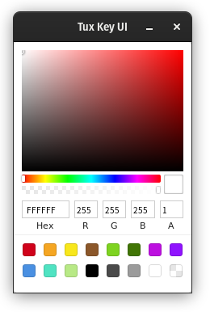

<p align="center" style="text-align: center">
   <br/>
</p>

# Tuxedo Keyboard UI

A simple UI for controlling Tuxedo Keyboard lights on Linux, written using [Wails](https://github.com/wailsapp/wails).

## Dependencies

Requires the [Tuxedo Keyboard kernel module](https://github.com/tuxedocomputers/tuxedo-keyboard) to be installed.

## Installation

It's recommended that you download a [release](https://github.com/leaanthony/tuxedo-keyboard-ui/releases/), however if you want to build yourself:

```
go get github.com/wailsapp/wails/cmd/wails
go get github.com/leaanthony/tuxedo-keyboard-ui
cd tuxedo-keyboard-ui
wails build
```